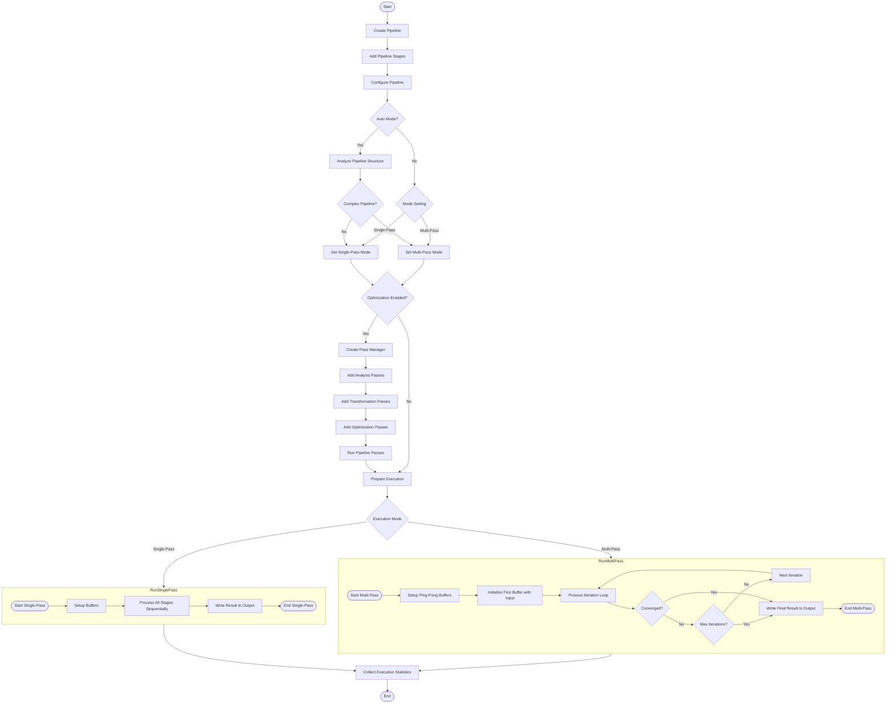

```mermaid
flowchart TB
    Start([Start]) --> CreatePipeline[Create Pipeline]
    CreatePipeline --> AddStages[Add Pipeline Stages]
    AddStages --> ConfigurePipeline[Configure Pipeline]
    ConfigurePipeline --> DetectMode{Auto Mode?}
    
    DetectMode -- Yes --> AnalyzePipeline[Analyze Pipeline Structure]
    AnalyzePipeline --> DetermineMode{Complex Pipeline?}
    DetermineMode -- Yes --> SetMultiPass[Set Multi-Pass Mode]
    DetermineMode -- No --> SetSinglePass[Set Single-Pass Mode]
    
    DetectMode -- No --> CheckMode{Mode Setting}
    CheckMode -- Single-Pass --> SetSinglePass
    CheckMode -- Multi-Pass --> SetMultiPass
    
    SetSinglePass --> Optimize{Optimization Enabled?}
    SetMultiPass --> Optimize
    
    Optimize -- Yes --> CreatePassManager[Create Pass Manager]
    CreatePassManager --> AddAnalysisPasses[Add Analysis Passes]
    AddAnalysisPasses --> AddTransformationPasses[Add Transformation Passes]
    AddTransformationPasses --> AddOptimizationPasses[Add Optimization Passes]
    AddOptimizationPasses --> RunPasses[Run Pipeline Passes]
    RunPasses --> PrepareExecution[Prepare Execution]
    
    Optimize -- No --> PrepareExecution
    
    PrepareExecution --> CheckExecMode{Execution Mode}
    CheckExecMode -- Single-Pass --> RunSinglePass[Run Single-Pass Execution]
    CheckExecMode -- Multi-Pass --> RunMultiPass[Run Multi-Pass Execution]
    
    RunSinglePass --> CollectStats[Collect Execution Statistics]
    RunMultiPass --> CollectStats
    
    CollectStats --> End([End])
    
    %% Subgraph for Single-Pass Execution
    subgraph RunSinglePass
        SP_Start([Start Single-Pass]) --> SP_SetupBuffers[Setup Buffers]
        SP_SetupBuffers --> SP_ProcessStages[Process All Stages Sequentially]
        SP_ProcessStages --> SP_WriteResult[Write Result to Output]
        SP_WriteResult --> SP_End([End Single-Pass])
    end
    
    %% Subgraph for Multi-Pass Execution
    subgraph RunMultiPass
        MP_Start([Start Multi-Pass]) --> MP_SetupPingPong[Setup Ping-Pong Buffers]
        MP_SetupPingPong --> MP_InitInput[Initialize First Buffer with Input]
        MP_InitInput --> MP_IterationLoop[Process Iteration Loop]
        MP_IterationLoop --> MP_CheckConvergence{Converged?}
        MP_CheckConvergence -- No --> MP_CheckMaxIter{Max Iterations?}
        MP_CheckMaxIter -- No --> MP_NextIteration[Next Iteration]
        MP_NextIteration --> MP_IterationLoop
        MP_CheckMaxIter -- Yes --> MP_WriteResult[Write Final Result to Output]
        MP_CheckConvergence -- Yes --> MP_WriteResult
        MP_WriteResult --> MP_End([End Multi-Pass])
    end
```